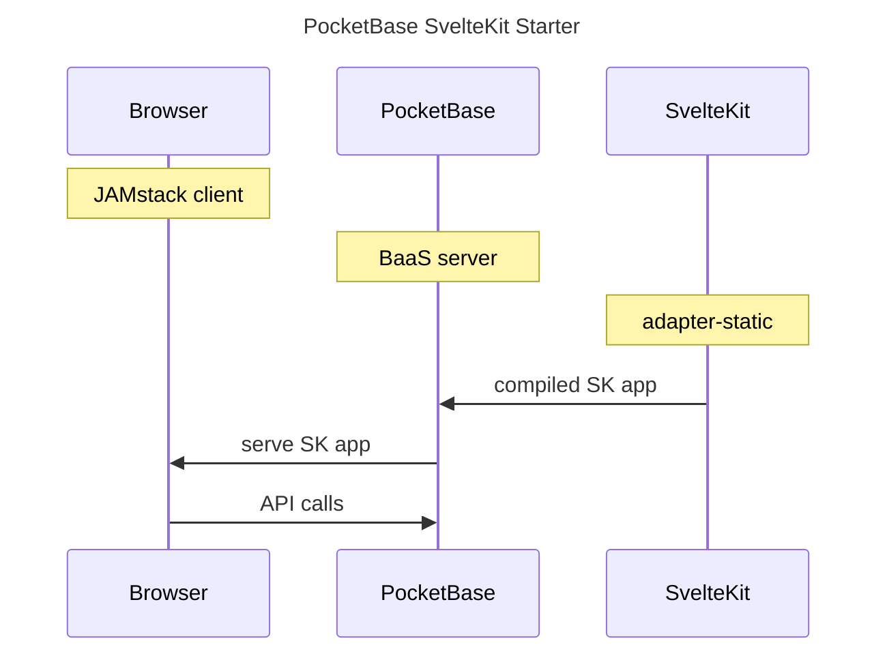
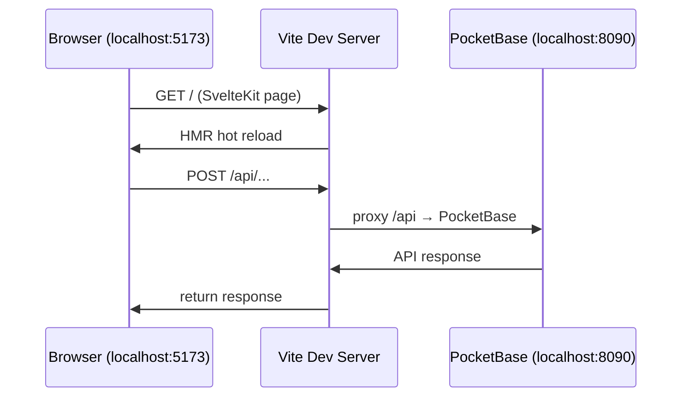

# PocketBase / SvelteKit Starter App



Use this project as a starting point for your own _customized_
[PocketBase](https://github.com/pocketbase/pocketbase) backend
with [SvelteKit](https://kit.svelte.dev) frontend.
This is a simple yet high-performance frontend+backend combination, since
frontend is static and backend is a single compiled Golang binary (JAMstack baby!).

- SK (SvelteKit) frontend is fully static, client-side only, so that here is no need
  for Bun/NodeJS at runtime. It is generated using
  [`adapter-static`](https://github.com/sveltejs/kit/tree/master/packages/adapter-static)
  and `ssr` is OFF.
- UI styled with [oat-css](https://oat.ink/) (lightweight semantic CSS framework)
  and [Bootstrap Icons](https://icons.getbootstrap.com/).
- **mdsvex** enabled: pages can be `.md` (Markdown + Svelte) or `.svelte`. The front page (`+page.md`) demonstrates this.
- **AI-ready**: [AGENTS.md](./AGENTS.md) gives AI coding assistants full context on architecture, commands, and gotchas.
- PB (PocketBase) provides complete (and _fast_) backend including:
  - databse (SQLite)
  - CRUD API for database
  - realtime subscriptions for LIVE data (server push to browser)
  - Authentication and Authorization (email + social login/oauth2)
  - blob/file storage (local filesystem or S3)
  - Extend with hooks and API endpoints in ...
    - [JavaScript](https://pocketbase.io/docs/js-overview/) for easy development.
      See the example [main.pb.ts](./pb/pb_hooks/main.pb.ts).
    - OR [Golang](https://pocketbase.io/docs/go-overview/) for full performance
      See `main.go`
- PocketBase can be downloaded as binary, and yet be extended with JavaScript.
  But if you want to extend it with custom Golang code then code is included
  to compile it locally with extensions such as custom endpoints (e.g. `/api/hello`)
  and database event hooks (e.g. executing Go handler functions when a database row is created)
- A full live development setup is included
  - Hot Module Reloading (HMR) of your frontend app when you edit Svelte code (including proxying requests to the PocketBase backend via `vite`)
  - Hot reloading (restarting) of the PocketBase server using `modd` when you edit Go code
  - Hot reloading (restarting) of the PocketBase server when JS code is changed in `./pb/pb_hooks`

To understand the backend, see [./pb/README.md](./pb/README.md) ("pb" == PocketBase)
To understand the frontend, see [./sk/README.md](./sk/README.md) ("sk" == SvelteKit)

Read those README files before proceeding.

# Setup

Follow these steps CAREFULLY, or else it won't work. Also read the README files referred above before proceeding.

## Git Clone

```
git clone <url-of-this-repo> pbsk
cd pbsk
```

## With Docker

This method is strongly recommended method for setting up this application in most use cases, especially when customizing with Go code.

Make sure your Docker daemon is running then complete the following steps:

1. Copy`.env.example` to `.env` and then edit it to match your environment.
2. Also, if you wish, copy `docker-compose.override-example.yml` to `docker-compose.override.yml` and edit it to your taste before proceeding.
3. And then just run `docker compose up -d`.
4. Visit http://localhost:5173 to see the frontend dev server running.
5. Visit http://localhost:5173/\_ to see the backend server and setup the first admin user.
6. Both sides are working if you navigate to the http://localhost:5173/hello page on the development server
   and there is an API response that says "Hello World!"

### How it works

A single Docker container runs both PocketBase and the SvelteKit dev server (when `DEV=true`):



- **DEV=true** (default): Vite runs on `localhost:5173`, proxies `/api` and `/_` to PocketBase on `localhost:8090` (configurable via `POCKETBASE_URL` env var). Full HMR for frontend edits.
- **DEV=false** or unset: Only PocketBase runs, serving the pre-built `sk/build/` on `localhost:8090`. No Vite, no HMR.

To access ports from the host, copy the override example:
```bash
cp docker-compose.override-example.yml docker-compose.override.yml
```

## Without Docker

We strongly recommend using Docker for the best experience, but you can also run the backend and frontend separately without Docker.

1. In `pb` folder:

- Setup the backend server by running `go mod tidy`
- Run `go run main.go serve --dev` to run the backend at http://localhost:8090.
- Visit `http://localhost:8090/_` to create your first admin user.

2. In `sk` folder:

- Setup the frontend server by running `bun install`
- Run the frontend dev server using `bun run dev`
- Visit `http://localhost:5173` to see the frontend running.

## Standard pocketbase binary downloaded from GitHub

This method is a good alternative for simple use cases that don't use either Docker or Go, and instead uses JavaScript-exclusive customizations.

1. [Download the latest version of PocketBase.](https://github.com/pocketbase/pocketbase/releases/latest)
   - The versions support Darwin, Linux, and Windows. Make sure that you download the correct version that supports itself within the OS that you are using.
2. Extract the `pocketbase.exe` from the `.zip` file you downloaded into the `/pb` folder within your project.
3. Set up the backend
   - Open a new terminal, navigate to the `/sk` directory and run the command `npm run backend`
     - _For Windows:_ You will have to edit the `"backend"` script in the `./sk/package.json` file to `cd .. && cd pb && pocketbase serve --publicDir=../sk/build`
     - _For Mac:_ _Please contribute_
4. Set up the frontend
   - Open a new terminal, navigate to the `/sk` directory and run the following
     - First install dependencies using `npx pnpm install`
     - Then, `npm run dev`
5. Extend JavaScript by [checking out this documentation here.](https://pocketbase.io/docs/js-overview/).

## Custom pocketbase binary compiled with Golang Tools

This method works if you have Go Tools installed and want to set up the machine directly on your specific OS and you don't want to use Docker.

1. Verify that the Go compiler is installed on your machine by opening a terminal and running `go version`. If there is an error, set up the go compiler in acccordance with the type of OS you are using.
2. Make sure you `go.mod` file is ready to be built by navigating to the `/pb` directory and running `go mod tidy` in the terminal, especially if the file is throwing errors.
3. In the same terminal, run `go build`. This may take a moment
   - If you want to use `modd` for live devlopment, after building, install the latest version by running `go install github.com/cortesi/modd/cmd/modd@latest`, test the installation by running `modd`. If successful, data migration should occur and a backend development server should be running. You can learn more by reading about it in the README located in the `/pb` directory.
4. Open a new terminal, and run `cd sk && npm run develop`. When you open the localhost page in your browser, the “Hello” page should have an “Hello World” message coming from the API response

# Developing

Visit http://localhost:5173 (Vite + SvelteKit) or http://localhost:8090 (PocketBase admin UI at /_)

With `DEV=true`, changes to Svelte code hot-reload instantly via Vite HMR.
Changes to PocketBase JS hooks (`pb/pb_hooks/`) auto-reload.
Changes to Go code (`pb/main.go`) require `RELEASE=custom` and `modd` for live reload.
The `ref-ui` page (`/ref-ui`) is a living style guide showing all UI components, patterns, and oat-css usage — check it before building new features.

This setup turns off automatic generation of database migration files by setting `--automigrate=false`. You can still generate migration files manually by running `pocketbase migrate create <name>` or `pocketbase migrate collections` to create migration files for your collections.

# Usage

To use the app as a user / tester ...

- visit the frontend URL (e.g. http://localhost:5173)
- Navigate around. The Home page is not very interesting.
- The `hello` page shows and example of frontend calling a custom backend API implemented in Go.
- The `posts` page shows all existing posts. If that page is empty, then you might want to create some posts. You must be logged in to be able to create posts.
- Sign in with the test user credentials from `.env` (`PB_USER_EMAIL` / `PB_USER_PASSWORD`). These are created automatically on first startup by the entrypoint.
- Alternatively, use the `Login` form to register a new account (check the `register` checkbox).

The above are just some sample features. Now go ahead and implement all kinds of new features.

- Create new collections.
- Create new pages that manipulate the above collections.

# Building

See the build process details in the README files for backend and frontend.

# Configurable Hooks

Please read about the "hooks" system in [./pb/README.md](./pb/README.md)
It is a very easy and powerful way to extend your application with minimal
configuration and perhaps no code.

# Deploying

See [DEPLOYMENT.md](./DEPLOYMENT.md) for production deployment: Docker, VPS, Cloudflare, S3/R2, Litestream, email, and security hardening.

# Feedback

Please provide feedback by
[opening an issue](https://github.com/spinspire/pocketbase-sveltekit-starter/issues/new)
or
[starting a discussion](https://github.com/spinspire/pocketbase-sveltekit-starter/discussions).
